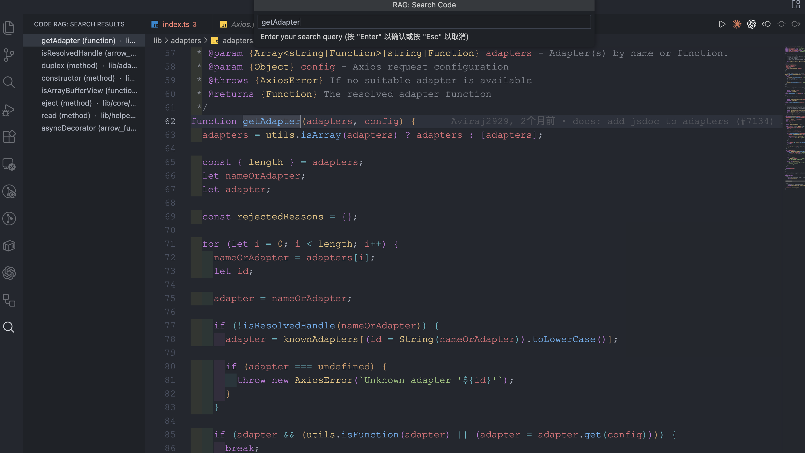
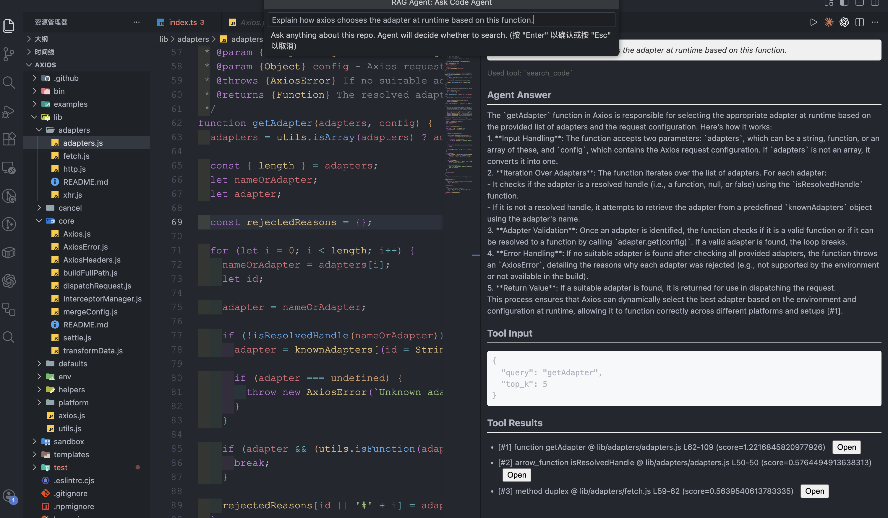
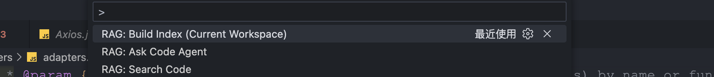

# CodeRAG Agent (VS Code Extension)

> AST-aware code RAG + local Docker backend + workspace-isolated indexes.

⚠️ **Language support notice**  
Currently, CodeRAG Agent only supports **JavaScript / TypeScript** projects.  
Support for more languages (Python, Go, etc.) is under active development.

**CodeRAG Agent** turns your VS Code workspace into a searchable “code brain”.  
Instead of just autocomplete, it builds a semantic index of your repo (with AST-aware chunking) and lets you:

- search code by natural language or symbols,
- ask “why/how” questions about the implementation,
- use an Agent that can decide when and where to search the codebase.

---

## ✨ Features

- **AST-aware code RAG**  
  Source code is parsed into syntax-aware chunks (functions, classes, exports…), not blind fixed-size text windows.

- **Workspace-isolated indexes**  
  Each VS Code workspace is indexed into its own ChromaDB collection (`code_chunks__<workspace-id>`).  
  No cross-project contamination.

- **One-click indexing**  
  The extension zips the current workspace, uploads it to the local backend, and triggers a background job:
  `zip → unzip in container → chunk → embed → ingest into Chroma`.

- **Hybrid semantic search**  
  Combines vector similarity with symbol-aware boosting (function/class names, AST paths).

- **LLM-powered explanations & Agent**  
  Use `Explain` or `Agent` to get guided explanations that reference real code.

- **Local-first deployment**  
  All indexing runs in your Docker container. Code never leaves your machine except to call your own LLM provider.

---

## 🧱 Architecture at a Glance

- **VS Code extension** (TypeScript)
  - Commands: `Search`, `Explain`, `Agent`, `Build Index`
  - Packs current workspace into a `.zip`, uploads via `/index/upload_and_build`
  - Adds `x-workspace-id` header for all RAG calls

- **Backend API** (FastAPI + Docker)
  - `/index/upload_and_build`: save zip → enqueue RQ job
  - `/index/status/{job_id}`: job status
  - `/search`, `/explain`, `/explain_stream`, `/agent/explain`: all workspace-aware

- **Indexer & storage**
  - `chunker.py` → JSONL chunks
  - `embed_ingest.py` → ChromaDB (PersistentClient)
  - `HybridSearcher` → semantic + symbol-boost search

---

## ✅ Requirements

- **Docker** installed and running
- **Git** (to clone the backend repo)
- **OpenAI-compatible API key** for full Agent functionality
  - Best tested with `gpt-4o` / `gpt-4o-mini`

---

## 🚀 Backend Setup

Clone the backend repo (this project) and start the Docker stack:

```bash
git clone https://github.com/Achernar-Eridani/code-rag
cd code-rag

# 1. Create environment file
cp .env.example .env

# 2. Edit .env and set your API key
#    OPENAI_API_KEY=sk-...

# 3. Start backend (API + Redis + Worker + Chroma)
docker compose up -d --build
````

After this, the backend should be available at `http://localhost:8000` by default.

---

## 💻 VS Code Extension Usage

### 1. Install & configure

1. Install **CodeRAG Agent** from VS Code Marketplace.
2. Open a project folder as a workspace.
3. Open Settings (`Ctrl+,` / `Cmd+,`) and search for `rag`:

Core options:

* `rag.apiBase` – backend base URL
  Default: `http://localhost:8000`
* `rag.apiKey` – optional API key override

  * If set, the extension sends this via `x-api-key` header.
  * If empty, backend will use `OPENAI_API_KEY` from `.env`.

Advanced options (may vary depending on your `package.json`):

* `rag.topK` – number of candidates per search (default: 8)
* `rag.symbolBoost` – weighting for symbol matches
* `rag.maxTokens` – max tokens for LLM responses
* `rag.maxCtxChars` – max characters of retrieved context

---

### 2. Build index for the current workspace

Before search/explain/agent will work well, you need to build an index for the current workspace.

1. Press `Ctrl+Shift+P` (`Cmd+Shift+P` on macOS)
2. Run: **`RAG: Build Index (Current Workspace)`**
3. Watch the progress notification:

   * `Zipping source code…`
   * `Uploading zip…`
   * `Indexing on server…`
4. When finished, you should see a success notification.

Under the hood:

* The extension zips your workspace (excluding `node_modules`, `dist`, `.git`, etc.)
* Sends the zip + a stable `workspace_id` to `/index/upload_and_build`
* Backend unzips to `data/workspaces/<workspace-id>/src` and builds:

  * `data/workspaces/<workspace-id>/chunks.jsonl`
  * Chroma collection: `code_chunks__<workspace-id>`

---

### 3. Search & Explain

#### Search code

* Command Palette → **`RAG: Search Code`**

  * If you have a selection, it is pre-filled as the query
  * Results appear in the **RAG Search** view (TreeView on the side)
  * Click an item to jump to the file & range

#### Explain selection

* Select a piece of code in the editor
* Command Palette → **`RAG: Explain Selection`**
* Or use the context menu if you wired it
* An Explain panel opens with:

  * natural-language explanation
  * evidence references to chunks in your repo

---

### 4. Ask the Agent

* Command Palette → **`RAG: Ask Code Agent`**
* Ask any question like:

  * “How does the authentication flow work?”
  * “Where is the Axios adapter selected at runtime?”
* The Agent:

  * decides when to call `search_code`
  * grounds its reasoning in code snippets from your workspace
  * returns an answer plus a list of tool results

> **Note:** Agent mode is currently optimized for OpenAI-compatible models (GPT-4o / GPT-4o-mini).
> Other providers may work if they support the same API shape, but are not fully tested yet.

---

## 🔐 Privacy & Data

* All indexing happens **inside your Docker container**.
* The extension only sends your code to:

  * your own backend at `rag.apiBase`
  * and then to your configured LLM provider (via the backend).
* You fully control:

  * where the backend is hosted
  * which API key is used, and how.

---

## 🖼 Screenshots

> (Add image files under `images/` and keep paths in sync.)

* Search view

  

* Explain panel

  

* Build index command

  

---

## Limitations & Roadmap

Current limitations:

* Agent behavior is tuned primarily for OpenAI GPT-4o / mini.
* Test files / typings filtering is still evolving; some repos may need custom ignore rules.
* Large monorepos might require tweaking zip size limits and chunking strategy.

Planned improvements:

* Better filtering & ranking between runtime vs test code.
* Optional support for local LLMs via `RAG_LLM_PROVIDER=local`.
* More commands and richer UI in the search & explain views.

---

# 🇨🇳 中文说明 / Chinese README

> 下方是和上面英文部分等价的中文说明，方便中文用户阅读。
> ⚠️ **语言支持说明**

目前 CodeRAG Agent **仅支持 JavaScript / TypeScript 项目** 的索引与检索，  
对 Python / Go 等其他语言的支持正在开发中，后续版本会逐步开放。


## 📌 简介

**CodeRAG Agent** 是一个“懂代码结构”的 VS Code 智能助手。

它不会只看你当前打开的几行代码，而是会：

* 对整个仓库做 **AST 级别代码切片**，
* 把代码片段向量化存入本地 ChromaDB，
* 在你提问时，从整个项目中检索最相关的函数 / 类 / 模块作为上下文，
* 再用大模型生成带“证据引用”的回答。

---

## ✨ 功能亮点

* **AST 感知的代码切片**：按函数、类、导出等结构切分，而不是简单 N 字符截断。
* **工作区级索引隔离**：每个 VS Code Workspace 都有独立的向量集合（`code_chunks__<workspace-id>`），互不干扰。
* **一键构建索引**：插件自动打包当前项目为 zip，上传到后端，在容器里完成解压 → 切片 → 向量化 → 入库。
* **混合检索**：语义向量 + 符号信息（函数名/类名）加权，既能按含义找，又能按标识符找。
* **智能 Agent**：基于工具调用（Function Calling），自动决定是否检索代码库、检索哪些文件。

---

## ✅ 环境要求

* 本地已安装并运行 **Docker**
* 能访问 Git（克隆后端项目）
* 有一个 **兼容 OpenAI API 的 Key**（推荐直接用 OpenAI 官方 GPT-4o / GPT-4o-mini）

---

## 🏗 后端部署步骤

在本地拉起 CodeRAG 后端服务：

```bash
git clone https://github.com/Achernar-Eridani/code-rag
cd code-rag

# 1. 复制环境变量模板
cp .env.example .env

# 2. 编辑 .env，填写你的 OpenAI Key
#    OPENAI_API_KEY=sk-...

# 3. 启动容器（API + Redis + Worker + Chroma）
docker compose up -d --build
```

默认后端监听在 `http://localhost:8000`。

---

## 💻 VS Code 插件使用说明

### 1. 安装与基础配置

1. 在 VS Code 插件市场安装 **CodeRAG Agent**。
2. 打开任意一个项目文件夹作为 Workspace。
3. 打开设置（`Ctrl+,` / `Cmd+,`），搜索 `rag`。

常用配置项：

* `rag.apiBase`：后端地址，默认 `http://localhost:8000`
* `rag.apiKey`：可选。若填写，则插件会以 `x-api-key` 头传给后端

  * 若留空，则由后端使用 `.env` 中的 `OPENAI_API_KEY`

进阶配置（视你的 `package.json` 而定）：

* `rag.topK`：每次检索候选数量
* `rag.symbolBoost`：符号匹配加权
* `rag.maxTokens`：LLM 回复最大 token 数
* `rag.maxCtxChars`：注入上下文的最大字符数

---

### 2. 为当前工作区构建索引（必做）

第一次使用前，先为当前工作区建索引：

1. `Ctrl+Shift+P` / `Cmd+Shift+P`
2. 输入并执行：**`RAG: Build Index (Current Workspace)`**
3. 右下角会看到进度提示：

   * “Zipping source code…”
   * “Uploading zip…”
   * “Indexing on server…”
4. 成功后会弹出完成提示。

内部过程：

* 插件会打包当前 Workspace（自动忽略 `node_modules`、`.git`、`dist` 等目录）
* 生成一个稳定的 `workspace_id`，连同 zip 一起上传到 `/index/upload_and_build`
* 后端在容器里解压到：`data/workspaces/<workspace-id>/src`

  * 生成：`data/workspaces/<workspace-id>/chunks.jsonl`
  * 写入集合：`code_chunks__<workspace-id>`

---

### 3. 代码检索

* 命令面板 → **`RAG: Search Code`**

  * 若当前有选中内容，会自动用作搜索词
  * 结果显示在左侧的 **RAG Search** 视图中
  * 点击结果项可跳转到对应文件和行号

---

### 4. 代码解释（Explain）

* 选中一段代码
* 命令面板 → **`RAG: Explain Selection`**
* 打开的 Explain 面板会显示：

  * 自然语言解释
  * 对应证据（来自你的代码库的片段）

---

### 5. 智能 Agent 问答

* 命令面板 → **`RAG: Ask Code Agent`**
* 随便问，比如：

  * 「这个项目的登录流程是怎么实现的？」
  * 「Axios 在运行时是在哪选 adapter 的？优先级是什么？」

Agent 会：

* 自动决定是否调用 `search_code` 工具
* 在你的代码库中检索相关实现
* 基于真实代码给出回答，并返回工具调用结果列表

> 当前 Agent 模式已经针对 OpenAI GPT-4o / GPT-4o-mini 调整过提示词和调用逻辑，
> 其他兼容 OpenAI 协议的模型理论上也能接入，但暂未全面验证。

---

## 🔐 隐私与本地化

* 所有索引构建都在你的 Docker 容器内完成。
* 插件只会把代码发送给：

  * 你配置的后端 `rag.apiBase`
  * 后端再用你自己配置的 LLM Provider 调用大模型。
* 你可以完全控制：

  * 后端部署在哪里（本机 / 内网服务器 / 自己的云）
  * 使用哪个 API Key、是否需要通过插件覆盖后端的默认 Key。

---

## 🖼 截图示例

> 把自己的截图放到 `images/` 目录下，再把下面的图片路径改成对应文件名即可。

* 代码检索视图：

  

* Explain 结果面板：

  

* 一键构建索引命令：

  

---

## 🧭 已知限制 & 后续规划

当前版本的限制：

* Agent 对 OpenAI 模型支持最好，其他模型兼容性待完善。
* 某些大型 monorepo 可能需要手动调整忽略规则或 zip 上限。
* 测试文件 / 类型声明的过滤规则还在持续打磨中。

后续计划方向：

* 更智能地区分 runtime 代码与测试代码、类型声明。
* 提供对本地 LLM（如 llama.cpp）的更好支持。
* 强化 Agent 的“证据约束”，让回答更加可追溯、可验证。

---

**Enjoy building with CodeRAG Agent!**
如果你有任何建议或问题，欢迎直接在仓库里提 issue。

